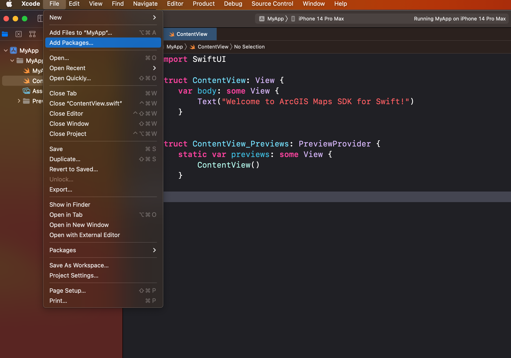

# arcgis-maps-sdk-swift

## Overview

This is the package repository for adding __[ArcGIS Maps SDK for Swift](https://developers.arcgis.com/swift/)__ to your project using Swift Package Manager (SPM).

### Instructions
1. Open your project in Xcode
2. Go to _File_ menu > _Add Package Dependencies_ option
   
3. Enter `https://github.com/Esri/arcgis-maps-sdk-swift` as the package repository URL
4. Choose a specific version or the latest version. Click Next.

That's it. ArcGIS Maps SDK for Swift has been integrated into your project as a Swift Package. 

Try out some of the [tutorials](https://developers.arcgis.com/swift/) or check out the [samples](https://github.com/Esri/arcgis-maps-sdk-swift-samples). In addition, check out the [toolkit](https://github.com/Esri/arcgis-maps-sdk-swift-toolkit) for some components that will simplify your iOS app development.

### Requirements
- Xcode 16 or newer

### Additional Resources
- Learn more about [Swift Package Manager](https://swift.org/package-manager/)
- Unfamiliar with SwiftUI? Check out Apple's [SwiftUI documentation](https://developer.apple.com/documentation/swiftui/).
- Want to start a new project? [Setup](https://developers.arcgis.com/swift/get-started) your development environment
- New to the API? Explore the documentation: [Guide](https://developers.arcgis.com/swift/) | [API Reference](https://developers.arcgis.com/swift/api-reference/documentation/arcgis/)
- Got a question? Ask the community on our [forum](https://community.esri.com/t5/swift-maps-sdk-questions/bd-p/swift-maps-sdk-questions)

### Licensing
COPYRIGHT © 2022-2024 Esri

All rights reserved under the copyright laws of the United States and applicable international laws, treaties, and conventions.

This material is licensed for use under the Esri Master License Agreement (MLA), and is bound by the terms of that agreement. You may redistribute and use this code without modification, provided you adhere to the terms of the MLA and include this copyright notice.

See use restrictions at [legal/EULA.txt](Legal/EULA.txt)

For additional information, contact: Environmental Systems Research Institute, Inc. Attn: Contracts and Legal Services Department 380 New York Street Redlands, California, USA 92373 USA

email: contracts@esri.com
